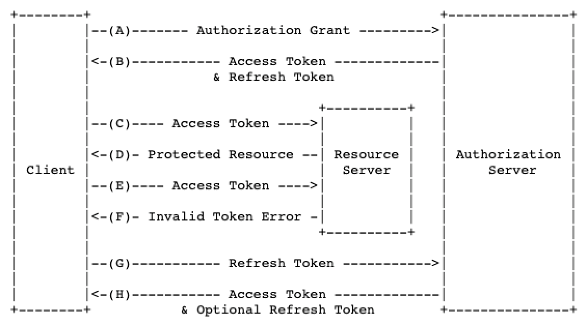

# User Authentication & Authorization

> 리소스 서버를 통해 리소스를 요청하고 응답을 받기 위해서는 자신이 누구인지를 인증해야하는 과정이 필요하다. 물론 인증없이 개방되어있는 리소스도 존재하지만 대부분의 서비스를 이용하기 위해서는 사용자 인증이 필요하다. 또한 해당 리소스에 대한 어떤 권한이 있는지를 확인하는 인가(권한)에 대한 확인이 필요하다.

###  Authentication

사용자 인증이란 하나의 세션동안 사용자의 신원을 확인하여 인증하는 것을 말한다. 인증 방법에는 다양한 방법이 있지만 대표적으로 다음과 같은 것이 있다.

- 지식 기반 인증

  : ID/PW와 같이 알고 있는 것을 통해 인증하는 방식을 말한다. 

- 소유 기반 인증

  : 신분증과 같이 가지고 있는 인증정보를 가지고 인증하는 방식을 말한다.

- 정적 생체 인증

  : 지문, 홍체와 같은 고정된 생체 인증정보를 가지고 인증하는 방식을 말한다.

- 동적 생체 인증

  : 목소리와 행동과 같이 동적 생체정보를 가지고 인증하는 방식을 말한다.

### Authorization

사용자 인가(권한 부여)란 인증된 사용자에게 그 사용자가 하려는 작업에 대한 권한이 있는지를 확인하거나, 권한을 부여하는것을 말한다.

인가를 위해서는 인증이 필수적인 과정이기때문에 그런지 두 개념을 묶어서 이야기하는곳이 많다.

# OAuth

> OAuth는 사용자 인가(Authorization) 프로토콜로 신뢰하기 어려운 기기에서 사용되는 API 서비스의 보안을 위한 훌륭한 프로토콜이다. 
>
> 사용자는 다양한 서비스(어플리케이션)을 이용하는데 모든 서비스마다 개인 인증 정보를 전달한다면, 모든 서비스의 인증정보를 기억하고 있어야하는 불편함이 있다. 또한 이용하는 서비스의 보안 상태가 어떠한지는 알길이 없다. 따라서 중요한 사용자 정보를 바로 넘겨주는것은 합리적이지 않다.
>
> 이러한 문제를 OAuth를 통해 해결할 수 있다. OAuth는 해당 기기 또는 해당 어플리케이션에 사용자 인증 정보를 전달하지 않고도 해당 리소스에 대한 인증과 권한을 획득할 수 있도록 해준다.
>
> OAuth는 토큰 인증 방식을 사용하고 있는데, 이 인증 방식이 보안에 좋은 이유는 API키 자체를 안전하지 않은 장소에 저장할 필요가 없고, 요청할 때에도 키 자체를 전달하지 않기 때문이다. 
>
> 현재 OAuth 2.0이 표준으로 되어있다.

### OAuth 2.0

OAuth 2.0에서는 Refresh token이라는 개념을 사용하고 있다. OAuth 1.0에서는 하나의 토큰을 사용했는데, 같은 토큰을 계속해서 사용하는것은 보안상 위험이 있다. 그래서 OAuth 2.0에서는 두 개의 토큰을 사용하는데, 흐름은 다음과 같다.

Access Token의 만료시간은 짧게하고, Refresh Token의 만료시간은 길게두어 Access Token만을 이용해서 Resource server와 통신하다가 토큰이 만료되면 Refresh Token을 Auth server에 보내어 새로운 Access Token을 발급받는 로직이다.이와같이 구현하면, 혹여나 Access Token이 탈취된다 하더라도 짧은 만료시간으로 보안을 유지할 수 있다. 

OAuth 2.0의 가장 큰 특징은 권한을 부여하는 authorization server와 Resource server를 분리하고 있다는 것이다. 일반적으로 authorization server는 믿을만한 보안 수준을 지닌 서버(facebook, twitter)를 사용한다.

OAuth 2.0에서 사용하는 토큰은 암호화되지 않은 일반 토큰으로 HTTPS에 의존하고 있다. 이 토큰대신  JWT를 이용해서 구현할 수도 있다.

